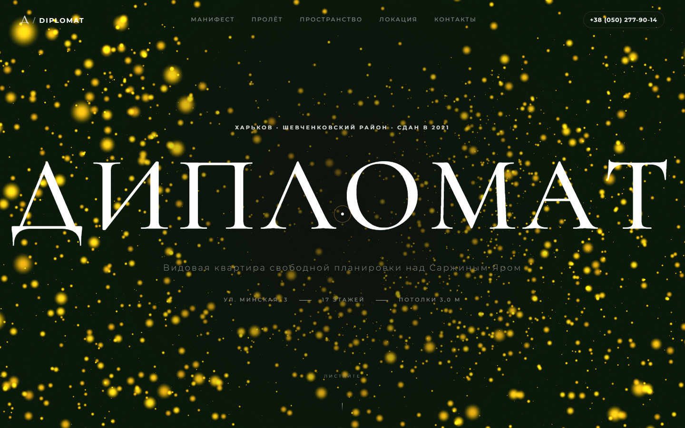

# 🏢 Lavine Real Estate — Interactive Web Experiences


High-performance, visual-first interactive web applications built for premium residential real estate projects in Kharkiv by **Lavine**. Featuring custom 3D WebGL camera flythroughs, custom lerp-based inertial scroll engines, interactive before/after renovation sliders, and ultra-responsive mobile UX.

---

## 🌟 Featured Projects

### 1. 🏛️ RC Diplomat (ЖК «Дипломат»)
> *Premium luxury residence overlooking Sarzhyn Yar park in Kharkiv.*

* **Live Demo**: [https://diplomat-kharkiv.vercel.app](https://diplomat-kharkiv.vercel.app)
* **Highlights**:
  * **3D WebGL Flythrough**: Interactive Three.js tunnel gallery responding smoothly to user scroll position.
  * **Custom Inertial Scroll Engine**: Smooth `lerp` physics engine balancing responsive touch gestures and momentum scrolling without touch-blocking glitches.
  * **Photorealistic Imagery**: High-end zero-HDR natural raw lighting color grading with subtle film grain.
  * **Interactive Panoramic Cinema**: Fullscreen image expand & dynamic caption synchronization.



---

### 2. 🌲 RC Skazka (ЖК «Сказка»)
> *Scandinavian-inspired eco-comfort residence surrounded by nature.*

* **Live Demo**: [https://skazka-kharkiv.vercel.app](https://skazka-kharkiv.vercel.app)
* **Highlights**:
  * **Interactive Before/After Sliders**: Synchronized dual-state touch & drag slider comparing raw construction states with luxury interior renders.
  * **Responsive Grid & Parallax**: Seamless layout adapting dynamically across high-DPI desktop screens and mobile viewports.
  * **Multilingual Architecture**: Built-in `i18n` support for multi-language toggle.


---

## 📐 Project Architecture

```
Lavine-Real-Estate/
├── RC Diplomat/                    # High-End Luxury Residence Project
│   ├── diplomat.html               # Main landing page structure
│   ├── diplomat_standalone.html    # Inlined production bundle
│   ├── js/
│   │   ├── scroll.js               # Custom momentum scroll lerp engine
│   │   ├── webgl.js                # Three.js 3D flythrough scene & shaders
│   │   ├── fx.js                   # Scroll triggers & DOM animation hooks
│   │   └── main.js                 # Application initialization
│   ├── css/
│   │   ├── base.css                # Typography, global reset & media filters
│   │   ├── components.css          # Gallery cards, sliders & layout grids
│   │   └── themes/diplomat.css     # Luxury theme tokens
│   ├── assets/                     # High-res photography & videos
│   └── bundle_standalone.py        # Single-file bundler script
│
├── RC Skazka/                      # Scandinavian Eco-Comfort Residence Project
│   ├── index.html                  # Main landing page structure
│   ├── skazka_v2.html              # Synchronized slider edition
│   ├── js/
│   │   ├── core/slider.js          # Before/After interactive slider logic
│   │   ├── core/i18n.js            # Translation system
│   │   └── scenes/skazka-scene.js  # Ambient backdrop effects
│   └── css/                        # Responsive Scandinavian design tokens
│
└── docs/
    └── previews/                   # Repository screenshots & media preview assets
```

---

## ⚡ Technical Innovations

### 🌀 Custom Smooth Scroll Engine (`js/scroll.js`)
Instead of relying on heavy third-party libraries, **RC Diplomat** utilizes an optimized vanilla JavaScript scroll engine:
$$\text{sy} \leftarrow \text{sy} + (\text{target} - \text{sy}) \times \text{EASE}$$
* Evaluates dynamic acceleration vectors for natural velocity curves.
* Automatically bypasses inertia on non-pinned native sections to preserve seamless mobile swipe gestures.

### 🎨 Color & Visual Grading
All generated imagery adheres to an authentic editorial photographic style:
`filter: saturate(1.25) sepia(0.10) hue-rotate(-5deg) contrast(1.05)`

---

## 🚀 Local Development & Deployment

### Running Locally
No build step or Node server required! Simply open the `.html` files in any modern web browser:
```bash
# Open RC Diplomat
start "RC Diplomat/diplomat.html"

# Open RC Skazka
start "RC Skazka/index.html"
```

### Production Bundling
To compile the standalone single-file distribution for clients:
```bash
cd "RC Diplomat"
python bundle_standalone.py
```

---

## 📄 License & Credits
Developed by **Lavine Real Estate**. All rights reserved.