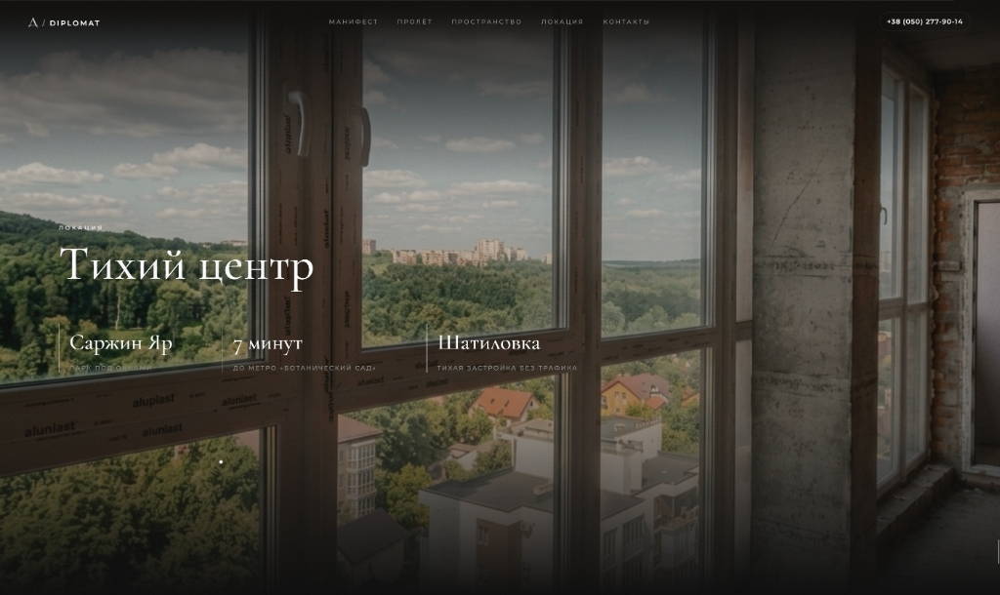
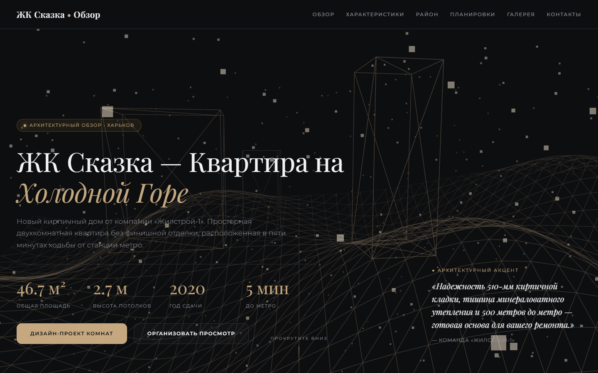

# Lavine Real Estate — Interactive Web Applications


High-performance, visual-first interactive web applications engineered for luxury residential real estate developments in Kharkiv by **Lavine**. Featuring custom 3D WebGL camera flythroughs, proprietary lerp-based inertial scroll engines, interactive dual-state renovation sliders, and ultra-responsive touch controls.

---

## Featured Projects

### 1. RC Diplomat (ЖК «Дипломат»)
> *Business-class luxury residence overlooking Sarzhyn Yar park.*

* **Production URL**: [https://diplomat-kharkiv.vercel.app](https://diplomat-kharkiv.vercel.app)
* **Technical Highlights**:
  * **3D WebGL Flythrough**: Interactive Three.js camera tunnel gallery projecting spatial architectural planes in 3D coordinate space.
  * **Custom Inertial Scroll Engine**: Smooth `lerp` physics engine balancing responsive touch gestures and momentum scrolling without touch-intercept glitches.
  * **Photorealistic Grading**: High-end zero-HDR natural raw lighting color profile with subtle film grain.
  * **Interactive Panoramic View**: Dynamic full-screen expand and synchronized location captions.



---

### 2. RC Skazka (ЖК «Сказка»)
> *Scandinavian-inspired eco-comfort residential complex.*

* **Production URL**: [https://skazka-kharkiv.vercel.app](https://skazka-kharkiv.vercel.app)
* **Technical Highlights**:
  * **Dual-State Renovation Sliders**: Synchronized interactive touch & drag slider comparing raw construction states with luxury interior renders.
  * **Responsive Adaptive Layout**: Grid system adapting across ultra-wide desktop monitors and mobile viewports.
  * **Multilingual System**: Built-in `i18n` translation module for localized content delivery.



---

## Repository Architecture

```
Lavine-Real-Estate/
├── RC Diplomat/                    # Business-Class Residence Project
│   ├── diplomat.html               # Main application document
│   ├── diplomat_standalone.html    # Production bundled distribution
│   ├── js/
│   │   ├── scroll.js               # Proprietary momentum scroll lerp engine
│   │   ├── webgl.js                # Three.js 3D flythrough scene & shaders
│   │   ├── fx.js                   # Scroll triggers & DOM animation hooks
│   │   └── main.js                 # Application bootstrapper
│   ├── css/
│   │   ├── base.css                # Typography, global reset & media filters
│   │   ├── components.css          # Cards, sliders & layout grids
│   │   └── themes/diplomat.css     # Brand design tokens
│   ├── assets/                     # High-resolution photography & video assets
│   └── bundle_standalone.py        # Single-file asset bundler
│
├── RC Skazka/                      # Scandinavian Eco-Comfort Residence Project
│   ├── index.html                  # Main application document
│   ├── skazka_v2.html              # Synchronized slider layout
│   ├── js/
│   │   ├── core/slider.js          # Interactive slider engine
│   │   ├── core/i18n.js            # Internationalization system
│   │   └── scenes/skazka-scene.js  # Ambient scene setup
│   └── css/                        # Design tokens & responsive styles
│
└── docs/
    └── previews/                   # Repository screenshots & documentation assets
```

---

## Core Engineering & Innovations

### Custom Smooth Scroll Engine (`js/scroll.js`)
To deliver native-level 60fps performance without heavy third-party dependencies, **RC Diplomat** employs a lightweight lerp scroll engine:

$$\text{sy} \leftarrow \text{sy} + (\text{target} - \text{sy}) \times \text{EASE}$$

* Evaluates real-time velocity vectors for continuous acceleration curves.
* Dynamically bypasses momentum smoothing on non-pinned native sections to eliminate swipe input lag on iOS and Android devices.

### Editorial Visual & Color Pipeline
Media assets undergo real-time CSS filter grading to maintain photographic consistency across screen types:

`filter: saturate(1.25) sepia(0.10) hue-rotate(-5deg) contrast(1.05)`

---

## Local Execution & Deployment

### Running Locally
No build pipeline or Node server required. Open the HTML documents directly in any web browser:

```bash
# Launch RC Diplomat
start "RC Diplomat/diplomat.html"

# Launch RC Skazka
start "RC Skazka/index.html"
```

### Production Bundling
To generate self-contained single-file HTML distributions for client presentation:

```bash
cd "RC Diplomat"
python bundle_standalone.py
```

---

## Corporate Ownership & License
Developed by **Lavine Real Estate**. All rights reserved.